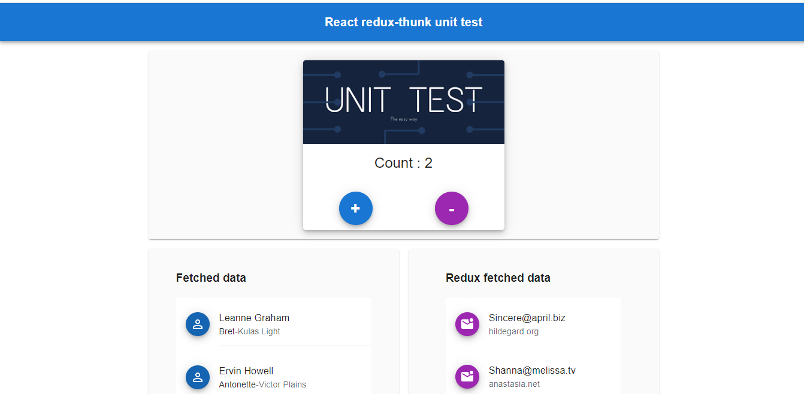
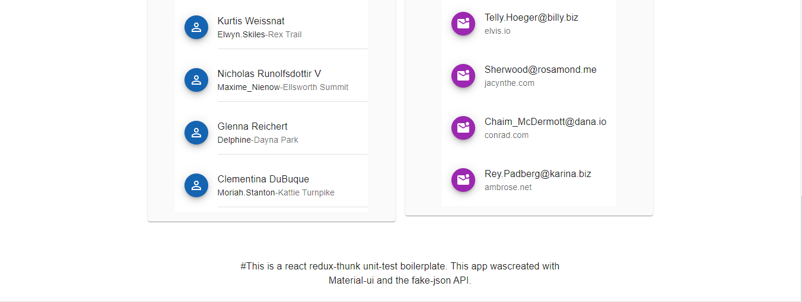

### `npm start`

Runs the app in the development mode.\
Open [http://localhost:3000](http://localhost:3000) to view it in your browser.

### `npm test`

Launches the test runner in the interactive watch mode.\
See the section about [running tests](https://facebook.github.io/create-react-app/docs/running-tests) for more information.

### `Demo`

The project was deployed to: [react-redux-thunk/unit-test/netlify](https://6299ddacc88e1551cef5b4cc--frabjous-basbousa-225c17.netlify.app/)

